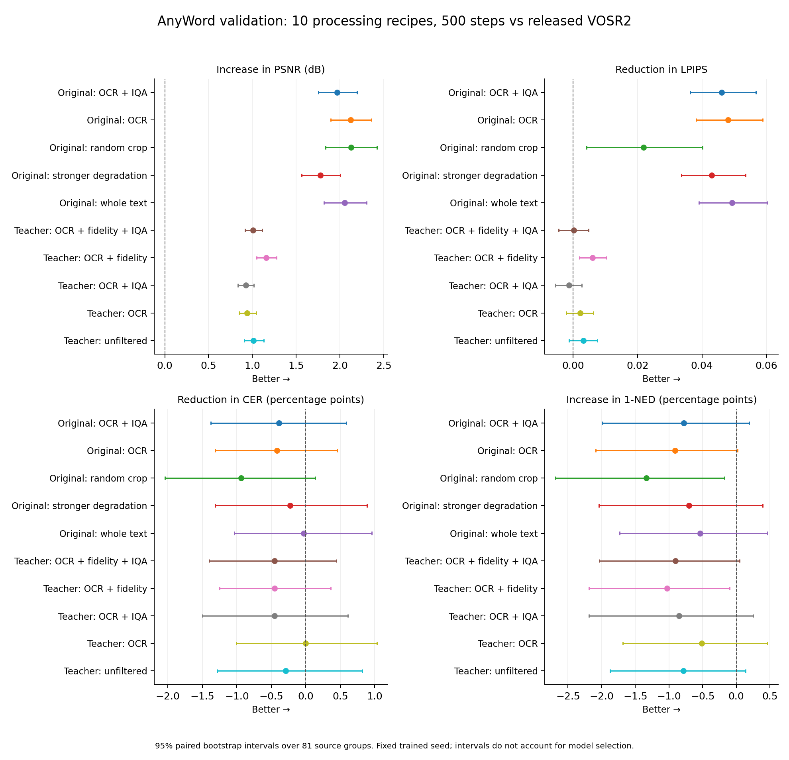
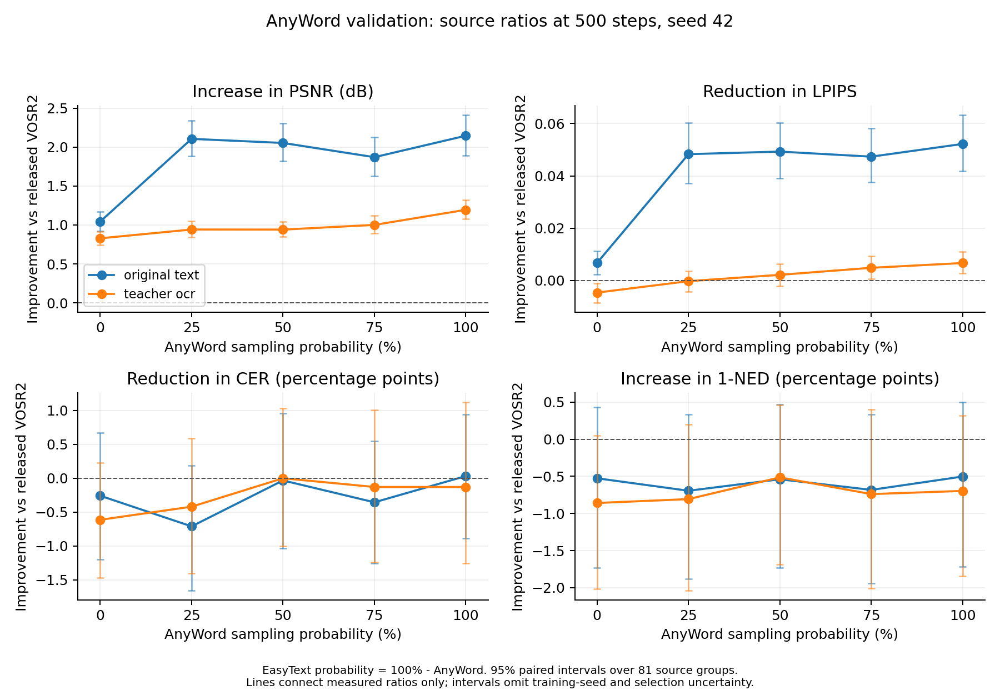
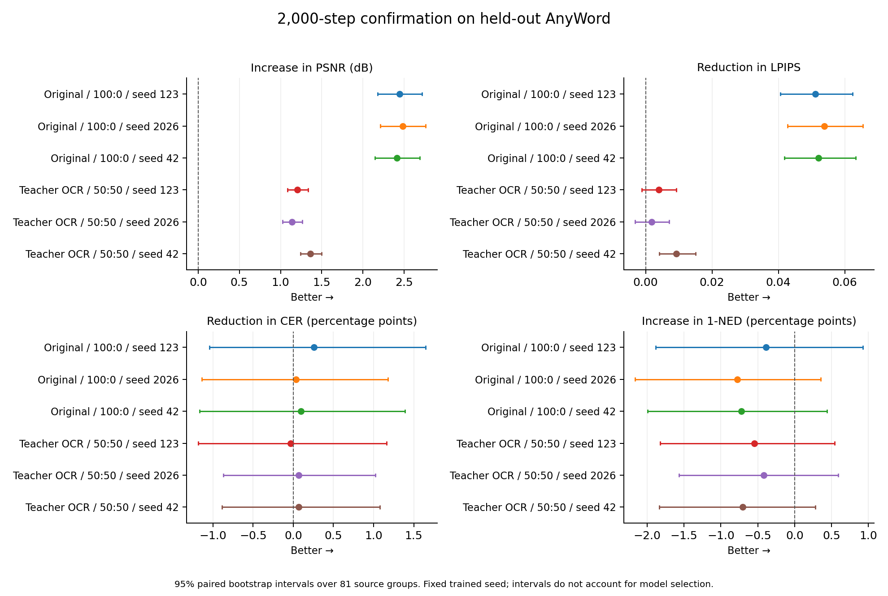
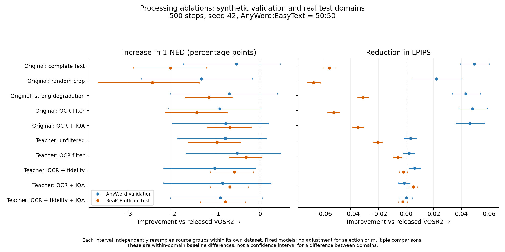
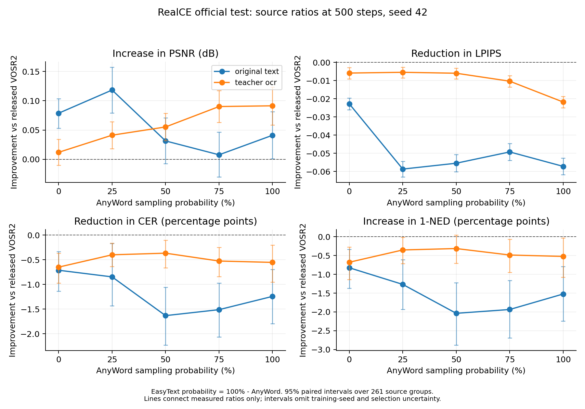
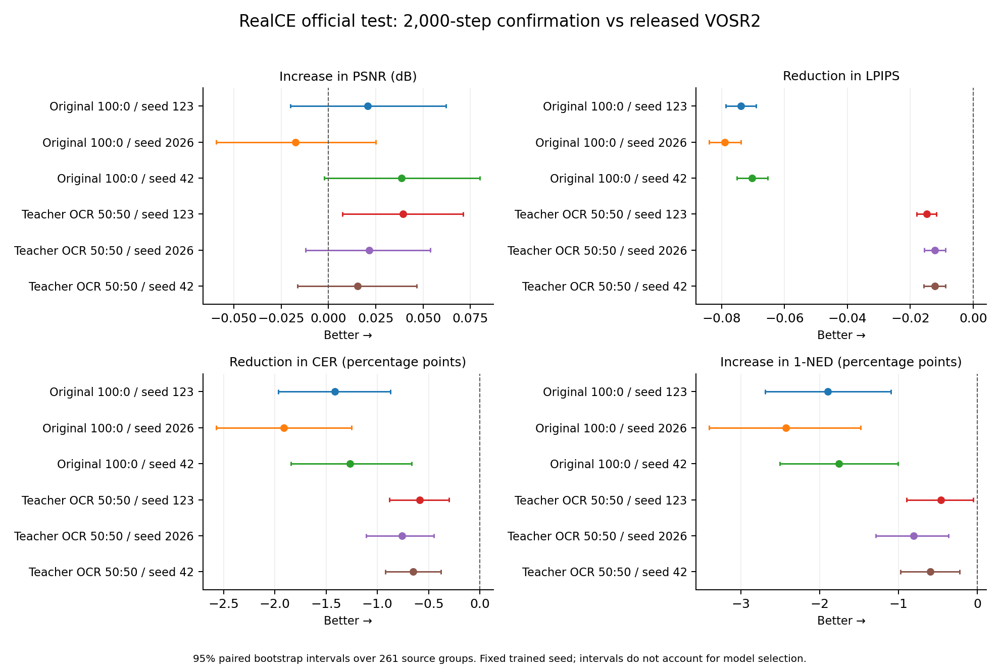

# VOSR2 数据续训实验

本研究保持原始 VOSR2 单步 1.4B 架构。用户已明确要求保留 cross-attention，
不使用 DyDiT，也不进行结构消融。训练入口为 `train_vosr2_sft.py`，直接实例化
`models.lightningdit.LightningDiT`，严格加载原始权重，并检查 1,393,943,616 个参数、
36 个 cross-attention 块以及零路由模块。VAE 和 DINO 冻结，原始 DiT 全参数续训。

已对全部 24 个模型（18 个筛选模型、6 个确认模型）的实际 safetensors 导出进行检查：
全部 849 个张量的名称和形状
与原始权重一致，每个模型的 36 个 cross-attention 查询权重均发生非零更新。
各权重摘要和逐模块差异保存在 `artifacts/vosr2_data_ablation/trained_checkpoint_audit.json`。

已完成 24 个模型的续训、验证和 RealCE 官方测试。每个模型覆盖 261 张图、3,414 个
文字框，完整结果连同两个基线共 26 行，见
[`realce_test_all.csv`](experiments/vosr2_data_ablation/orchestration/realce_test_all.csv)。
全部续训模型的测试 1-NED 点估计都低于发布模型；图像指标存在收益与代价，
没有找到在本次文字优先规则下应替换发布权重的续训方案。

验证集选型已冻结：在经过处理方式和配比筛选、进入三种子确认的两个方案中，
教师伪 GT、完整文字裁剪、OCR
置信度 ≥ 0.9 筛选、AnyWord:EasyText = 50:50 的三次确认均值排名第一。
这里的 50:50 是来源采样概率，随后均匀采样原图分组和组内裁剪；该方案未叠加参考
一致性或 MUSIQ 筛选。三个独立 2,000 步运行的验证 1-NED 为 0.7598 ± 0.0014，
仍低于原始 VOSR2 的 0.7653，所以冻结规则推荐保留发布权重。
最佳续训候选的代表导出为
`exp_vosr/vosr2_data/teacher_ocr_aw050_confirm_s42/export`，
其[完整配置](experiments/vosr2_data_ablation/orchestration/configs/teacher_ocr_aw050_confirm_s42.json)
和[冻结选择记录](experiments/vosr2_data_ablation/orchestration/final_validation_selection.json)
均已保存。下文分别报告数据域、图像指标和文字指标的取舍；官方测试不用于重新选型。

仓库内的[实验记录索引](experiments/vosr2_data_ablation/README.md)收录全部运行日志、
配置、统计比较和图表，并列出上述配方的完整超参数。所有 24 个续训模型中测试
1-NED 点估计最高的是同配方的 500 步、种子 42 运行，分数为 0.8682；其
[配置](../configs/experiments/vosr2_teacher_ocr.json)已提交。该描述性结果不替换验证规则
预先固定的 2,000 步代表导出，也未超过发布模型的 0.8713。

## 数据与划分

- VOSR2 固定 HF revision：`f24b3061b7f350b81e1907bdcfc27f71fb4ff3f3`。
- AnyWord-3M 使用官方 ModelScope ArT，revision
  `e4482d7081f36532f37bbba92cd29f5d9eaaa8bf`。原生标注和压缩包摘要与
  `docs/data_pipeline.md` 中的已核验摘要一致；从 5,603 张图抽取 1,024 张。
- EasyText 使用原生四个 Parquet 分片，HF revision
  `6997bd59c9645f9a0dbf024db3c3052a2dd8074c`；从 6,912 条记录抽取 1,024 条。
  API 抽样遇到 429 后改为完整分片上的均匀无放回抽样，未采用下载成功的前缀样本。
- 固定随机种子 42。输入图片按解码像素去重，并合并共享 group_id 或相同像素的分组。
  同一分组的所有裁剪、退化和伪 GT 共用 train/validation 划分，按组以 10% 概率分到验证。
  另用 DCT 感知哈希检查跨划分近似图：发现一对 EasyText 图片共用打字机背景，
  文字分别为 ENERGY 和 CONTACT。已记录视觉检查与验证排除清单；它们均不在用于
  选型的 AnyWord 验证集中。该相似性筛查不能证明所有近重复都已排除。
- 用 RealCE 官方 train 的 64 个固定场景做额外验证，所有 RealCE 数据均不进入续训。
  train 中的转录质量较弱，文字选型需要结合 AnyWord 的可信标注验证。
  官方 `val/valid_list.txt` 的 261 个场景是最终测试集，不用于选择数据比例或训练步数。

对这 64 张 RealCE train 图直接识别 GT 的补充审计覆盖 59 张有文字标注的图、801 个
文字框，OCR-A 仅为 34.21%、CER 为 25.32%、1-NED 为 0.7198。视觉抽查确认至少
存在明显转录错误，例如可见的 `Michael Zhang *` 被标为 `vighaelzh3ng米`。没有更改
这些原始标注；辅助验证的文字分数只能作有限参考，不进入配方选型。审计记录为
`realce_validation_label_audit.json`；这并不将全部识别差异都归因于标注错误。

额外对 1,928 张实际参与构造的来源图与 RealCE 261 个测试场景的原始 LQ、原始 GT
和处理后 GT（合计 783 个参照图像）核查重复，未发现完全相同的解码像素；在宽高比
相差不超过 3%、DCT 感知哈希距离不超过 4 的筛查中也未发现候选。全部来源像素
摘要与构造时一致。结果保存在 `cross_dataset_overlap_audit/`。这是整图相似性检查，
不能据此断言所有裁剪复制、场景重合或近重复均不存在。

`experiments.build_data` 复用现有管线的长边 1K 归一化、完整文字裁剪、坐标变换与
`experiments.training_data` 中的可复现模糊/降采样/噪声/JPEG 退化。
对照随机裁剪与保留完整文字的裁剪；后者等比例适配至 512×512，再以边缘像素补齐。
训练加载器不再二次随机裁剪，也不翻转文字。独立来源的采样概率由 source_weights
直接控制，避免整数重复次数与各来源大小共同改变实际配比。先选来源，再等概率选
原图分组，最后选该组内裁剪；日志记录实际抽样量。

每条管线都从各自的 HQ 裁剪退化生成训练 LQ。因此原图与教师管线的对照同时改变
HQ 监督图及由其生成的 LQ 像素；对应来源、裁剪几何、退化参数分布和随机种子保持
一致。其结果应解释为整条数据合成管线的差异。所有模型评测时共享预先保存的同一
套原始 GT 和验证 LQ。

教师候选由同一个冻结 VOSR2 生成，随后用相同裁剪参数处理。它们明确标为
`research_ablation_unreviewed` 和 `pseudo_ground_truth=true`，不写入正式管线的
accepted 列表。OCR 置信度、转录一致性与 MUSIQ 分数是实验筛选证据，不能证明人工
字形核验或 clarity/naturalness/artifacts 三项已经校准。EasyText 的场景描述不作为
文字转录。原图高置信 OCR 与伪 GT 一致时，仅记录 OCR 一致性。

## 训练与消融设计

配置模板：`configs/experiments/vosr2_original_text.json`。
固定 512 分辨率、有效 batch=4、AdamW 学习率 2e-6、50 步线性预热、BF16 计算、
FP32 可训练参数以及梯度检查点。每组都从同一个原始权重独立开始。
训练位于部署端点 t=1、r=0：

```
SR_latent = noise - model(concat(LQ_latent, noise), t=1, r=0, DINO(LQ))
loss = MSE(SR_latent, HQ_latent) + 0.1 * MSE(velocity, frozen_initial_velocity)
```

这是有监督的单步续训目标，不声称复原 VOSR2 未公开的训练配方。导出当前在线权重，
未使用 EMA。导出仍含原始 args.json 和完整 cross-attention，可供原有推理后端加载。
固定步数的筛选阶段为每组 500 步；筛选结果只用于决定后续实验，不作为最终最优结论。
实际比较：

1. 原图随机裁剪、原图完整文字裁剪；
2. 原图与教师伪 GT；
3. 不筛选、OCR 置信筛选、OCR 加参考一致性筛选、OCR 加通用 IQA 分位筛选，
   以及参考一致性和 IQA 同时筛选；
4. 当前轻退化与更强的模糊、噪声、JPEG 退化；
5. 固定处理方式下 AnyWord:EasyText = 100:0、75:25、50:50、25:75、0:100。

先在 50:50 配比下比较处理方式，再对验证排名前两种处理方式分别比较五种来源配比。
选型规则保存在 `configs/experiments/study_protocol.json`：先比较 1-NED，再以 CER、
LPIPS、PSNR 打破完全相同的分数；同时保留全部图像指标与 Pareto 取舍。
对组合排名前两组延长到 2,000 步，
使用种子 42、123、2026 复核。报告质量取舍和配对不确定性，并明确“最优”只覆盖
实际比较过的数据、预算和配比。2,000 步确认用于检验短跑排序与训练种子差异；固定
预算不保证收敛，也不能据此声称找到了全部数据配方或更长训练下的全局最优。
完成验证集选型后冻结选择，再对所有已完成的处理/配比消融和确认种子汇总 RealCE
测试指标。测试集指标只用于最终报告，不反馈到选型。

## RealCE 指标口径

数据下载自 [RealCE 官方仓库提供的链接](https://github.com/mjq11302010044/Real-CE)。
压缩包 SHA256：`6ede45dd5b6cc0f5b7562a29988741f9785110dd3a65937989bac48de71276ce`。
`experiments.prepare_realce` 对齐官方 loader 的空间处理：使用 valid_list、GBK 人工测试
标注、13mm→52mm 的 4× 配对、OpenCV 双三次降采样、GT 右下角 modcrop。
保存为 PNG 时将浮点 LR 四舍五入成 8 位，这项与原 loader 的数值差别已写入 protocol。
2× 入口亦支持 26mm→52mm 与 13mm→26mm 两种配对，但当前主实验是 4×。

- PSNR、SSIM：RGB，边界裁去 2 像素；LPIPS、DISTS 同样裁边。
- 文字框使用 GT 坐标，对各图按尺寸映射并透视校正。
- OCR：固定 PP-OCRv5_server_rec，batch=1，NFKC、去空白、保留大小写。
- OCR-A 是整条文字完全匹配率；CER 是总编辑距离/总标注字符数；
  1-NED 是每个文字框按较长字符串归一化后的相似度均值。
- OCR 识别器与原论文 CRNN 不同，因此不能将分数直接当作论文表格的复现。
- 数据筛选与结果评测使用同一 PP-OCRv5 识别器，测试图片和标注未参与训练筛选。
  因而结论限于该识别器下的文字表现；本研究未验证收益能否迁移到其他 OCR 系统。
- `--strict` 检查预测、GT 和标注全覆盖；OCR 少返回任何一个文字框就报错。

原始 VOSR2、双三次插值、最终续训模型采用相同指标与固定噪声种子。
训练/验证/测试输入、版本、原始下载、配置、逐样本结果和日志存放于
`artifacts/vosr2_data_ablation/`，权重存放于 `exp_vosr/vosr2_data/`。

## 运行与恢复

全部训练、验证选型和 RealCE 评测已完成，结果表、预测文件与报告均已核验。
`artifacts/vosr2_data_ablation/study_state.json` 记录完成状态。恢复或重跑时仍应通过
进程表或执行会话核实活动任务。训练用 OS 文件锁避免重复启动，并检查恢复时配置、数据摘要
和代码摘要一致；数据索引和噪声按优化器步数恢复。

```
OMP_NUM_THREADS=4 USE_TF=0 TORCH_COMPILE_DISABLE=1 TORCHDYNAMO_DISABLE=1 \
  python train_vosr2_sft.py --config configs/experiments/vosr2_original_text.json

# 中断后在同一配置上加 --resume；只有包含 training_state.pt 的 checkpoint 能恢复。
# 筛选实验完成后可丢弃 optimizer 状态，以保留磁盘给后续独立实验。
```

当前主环境为 Python 3.13、Torch 2.11/CUDA 13。Paddle 3.3.1 在该环境构造识别器时
发生段错误，因此 OCR 使用 `.venv-ocr` 内的 Python 3.11、Paddle 3.2.2、PaddleOCR 3.3.2。
`evaluate.py --ocr-python .venv-ocr/bin/python` 通过持久子进程调用真实 OCR，逐框检查数量。

`experiments.compare` 从逐图 CSV 和逐文字框识别记录重新计算全部指标，再核对汇总
文件。比较必须使用完全相同的图片、标签和指标设置。置信区间按原始图片分组做
5,000 次配对 bootstrap，保持同一原图的重叠裁剪在一起；CER 始终按字符总量聚合。
这只衡量固定训练种子下的场景不确定性，训练种子的差异另外报告。
这些是逐项 95% 区间，未作多重比较校正，也不包含候选筛选的不确定性。

固定数据顺序与噪声种子不等于训练权重位级可复现。原图 100:0、种子 42 的独立
2,000 步确认与其 500 步筛选模型使用相同初始权重、训练代码和数据摘要；前 500 步
的来源采样次数逐步一致，首步前向损失相同，但梯度范数和后续数值有所不同。
前 500 步总损失的最大绝对差为 0.000716，500 步权重也并非逐字节相同。
实验没有因此改变训练算法或预算；三个独立运行的标准差也包含这种执行数值差异，
不能只归因于种子取值。记录位于 `orchestration/same_seed_independent_run_audit.json`。

`experiments.run_study` 负责后续依赖、筛选、配比与多种子确认队列。它从逐样本结果
核对指标后生成配置，冻结每阶段排名，再运行最终测试。确认阶段按三个种子的均值
选组合，固定用种子 42 的权重作为该组合的代表导出，避免再挑选表现最好的种子。
如果最佳续训组合的验证排名仍低于原始模型，报告同时保留原始模型这一选择。
队列包含 10 个处理方式实验、8 个新增配比实验和 6 个长训练确认实验；每个已
完成模型都进入最后的 RealCE 报告。`orchestration/complete.json` 仅在全部评测核验后写入。
伪 GT 评分有独立的进程锁和可重连监督进程，在候选数据及原图 OCR 参考完成后立即
开始，与原图训练并行；评分前核验两种目标的裁剪、分组、标注和划分完全对应。
恢复队列时使用 PID 加进程启动时间识别正在运行的评分，避免重复启动。

协议版本 2 补充了 `teacher_fidelity_iqa`，覆盖参考一致性与通用 IQA 同时筛选的
组合。修订时仅原图完整文字裁剪和随机裁剪的验证结果已完成，强退化组仍在训练，
教师数据的任何训练结果均不可见。选择指标、每组预算与已完成配置保持不变。
原版快照保留在 `orchestration/protocol_snapshot.json`，版本 2 快照与修订原因分别为
`protocol_snapshot_v2.json`、`protocol_amendment_v2.json`。此次研究因此有一项公开记录
的前瞻性候选补充，不能将整个候选列表描述成在所有实验结果出现前一次性固定。

`experiments.run_final_test` 可在全部验证选型冻结后接手最终评测，最多并行两个独立
的推理/指标进程，以利用 OCR 等待期间的 GPU 空闲。它与训练协调器共用进程锁，
先重新核对所有处理方式、来源配比、确认种子、代表权重和逐样本验证结果，再运行
测试；活动协调器或缺失任何选型阶段都会阻止启动。接手时可通过 `--wait-for-pid`
等待原协调器留下的评测子进程退出，未完成的推理按逐图摘要检查后续跑。该入口的
覆盖、排序、预算与并发隔离测试已通过，并已在全部选型冻结后接手评测。
接手记录保存在 `orchestration/final_test_handoff.json`；没有中断任何训练。

配比阶段曾在一个已完成训练模型的验证初始化时遇到 GitHub HTTP 504：Torch Hub
虽有 DINO 缓存，仍尝试联网判断默认分支。推理加载器现明确使用同一 `main` 引用，
直接复用原缓存。禁止 Torch Hub 网络访问后，三张已评测图片的重跑 PNG 与修复前
逐字节相同；缓存权重与代码摘要已记录，训练代码摘要均保持一致。此次恢复保留已
完成的 500 步权重，接续未完成的验证。记录位于 `orchestration/cache_loader_incident.json`
与 `offline_loader_regression/summary.json`。

## 基线与验证结果（2026-10-02）

以下列出基线与合成验证结果，后文给出两个方案的三种子确认和完整官方测试结果。
选型仅使用验证数据，全部 24 个续训模型的官方测试已完成。

| RealCE 4× 测试，261 张图 | PSNR | SSIM | LPIPS | DISTS | OCR-A | CER | 1-NED |
| --- | ---: | ---: | ---: | ---: | ---: | ---: | ---: |
| 双三次插值 | 19.6526 | 0.6748 | 0.5169 | 0.2461 | 55.71% | 16.62% | 0.8013 |
| 原始 VOSR2 | 19.9099 | 0.7158 | 0.3343 | 0.1863 | 67.81% | 10.89% | 0.8713 |

共 3,414 个人工标注文字框。相同识别器直接识别 GT 时 OCR-A 为 85.30%、CER 为
4.15%、1-NED 为 0.9730；这些数值也包含识别器自身的误差。

| AnyWord 独立验证，150 个裁剪 | PSNR | SSIM | LPIPS | DISTS | OCR-A | CER | 1-NED |
| --- | ---: | ---: | ---: | ---: | ---: | ---: | ---: |
| 原始 VOSR2 | 25.8596 | 0.7984 | 0.1725 | 0.1544 | 55.36% | 27.07% | 0.7653 |
| 原图随机裁剪，50:50，500 步 | 27.9878 | 0.8401 | 0.1506 | 0.1279 | 55.58% | 28.00% | 0.7520 |
| 原图完整文字裁剪，50:50，500 步 | 27.9136 | 0.8424 | 0.1233 | 0.1179 | 55.79% | 27.10% | 0.7599 |
| 原图完整文字裁剪，更强退化，50:50，500 步 | 27.6396 | 0.8380 | 0.1295 | 0.1225 | 55.58% | 27.29% | 0.7583 |
| 原图完整文字裁剪，OCR 筛选，50:50，500 步 | 27.9826 | 0.8423 | 0.1244 | 0.1182 | 56.01% | 27.49% | 0.7562 |
| 原图完整文字裁剪，OCR + IQA，50:50，500 步 | 27.8278 | 0.8380 | 0.1265 | 0.1201 | 56.65% | 27.45% | 0.7575 |
| 教师伪 GT，完整文字裁剪，不筛选，50:50，500 步 | 26.8739 | 0.8235 | 0.1694 | 0.1520 | 55.36% | 27.36% | 0.7574 |
| 教师伪 GT，完整文字裁剪，OCR 筛选，50:50，500 步 | 26.8002 | 0.8203 | 0.1703 | 0.1505 | 56.01% | 27.07% | 0.7602 |
| 教师伪 GT，OCR + 参考一致性，50:50，500 步 | 27.0175 | 0.8245 | 0.1665 | 0.1506 | 55.15% | 27.52% | 0.7550 |
| 教师伪 GT，OCR + IQA，50:50，500 步 | 26.7843 | 0.8212 | 0.1738 | 0.1540 | 54.94% | 27.52% | 0.7568 |
| 教师伪 GT，OCR + 参考一致性 + IQA，50:50，500 步 | 26.8701 | 0.8226 | 0.1723 | 0.1536 | 54.94% | 27.52% | 0.7562 |

十组处理方式已全部完成，固定验证规则选出 `teacher_ocr` 和 `original_text` 进入
来源配比阶段。其 1-NED 分别为 0.7602、0.7599，都低于原始模型的 0.7653；因此
这些 500 步结果用于筛选后续候选，不能据此认定续训提高了文字表现。完整冻结排名、
逐样本核验后的七项指标与配对区间分别见 `orchestration/processing_selection.json`、
`processing_validation.csv`、`processing_comparisons.json`。

按全部七项指标的点估计判断，原图完整文字、原图随机裁剪、原图 OCR、原图
OCR + IQA 和教师 OCR 五组没有被另一组同时在全部指标上超过。原图完整文字的
LPIPS/DISTS 最好，随机裁剪的 PSNR 最高，原图 OCR + IQA 的 OCR-A 最高；这些
取舍不改变以 1-NED 为主的后续选择。该 Pareto 描述不是显著性检验，记录在
`orchestration/processing_pareto.json`。

验证集含 81 个原始图片分组、466 个文字框。首组续训相对初始权重的 PSNR 变化为
+2.0540 dB，分组配对 95% 区间为 [1.8200, 2.3043]；1-NED 变化为 −0.0054，
区间为 [−0.0174, 0.0047]。图像指标改善，但当前证据不足以认定文字指标发生改善或
退化。逐样本核验和区间存于 `comparisons/first_screen/`。

相同识别器直接识别这 150 个验证 GT 时，466 个文字框的 OCR-A 为 71.46%、CER 为
12.89%、1-NED 为 0.8786。这是实际 GT 识别参考，不能视为理论上限；结果复用已有
原图评分中的真实识别记录，并逐项验证 GT 像素、浮点裁剪多边形、参考文字与通道
约定一致，证据见 `synthetic_validation_gt_ocr_reference.json`。

两种裁剪对照使用相同的初始权重、训练代码、来源与训练参数；各自实际采样 AnyWord
985 次、EasyText 1,015 次，均有完整且有限的 500 步训练记录。完整文字裁剪相对随机
裁剪的 1-NED 变化为 +0.0080，95% 区间 [0.0012, 0.0154]；LPIPS 变化为 −0.0273，
区间 [−0.0370, −0.0177]；PSNR 差异 −0.0742 dB 的区间包含零。这个固定种子的对照
支持保留完整文字裁剪，但没有证明续训文字质量优于初始模型。对照核验及区间存于
`comparisons/text_vs_random/`。

更强退化相对轻退化的 1-NED 差异为 −0.0016，区间 [−0.0083, 0.0053]；当前样本
不能明确区分两者的文字表现。图像指标在这套固定的轻退化验证数据上偏向轻退化
训练，例如强退化的 PSNR 低 0.2740 dB，区间 [−0.3345, −0.2153]。这些验证结果
不能直接推广为 RealCE 测试集上的差异；结果存于 `comparisons/strong_vs_mild/`。

原图 OCR 置信筛选相对未筛选的 1-NED 差异为 −0.0037，区间 [−0.0094, 0.0018]，
暂未观察到明确的文字收益。OCR-A 的微小上升对应 466 个文字框中多识别正确 1 个，
但字符总编辑距离增加 12；因此完整匹配率、CER 和 1-NED 需要一起解释。结果存于
`comparisons/original_ocr_vs_unfiltered/`。

加入 IQA 后相对仅 OCR 筛选的 1-NED 变化为 +0.0013，区间 [−0.0036, 0.0061]；
相对未筛选为 −0.0024，区间 [−0.0073, 0.0023]。当前短跑尚未证明原图筛选可提高
文字恢复能力；这些结果也同时包含筛选减少训练原图多样性的影响。

在对应来源、裁剪、退化与训练预算下，未筛选教师伪 GT 相对原图目标的 PSNR 变化为
−1.0397 dB，95% 区间 [−1.2349, −0.8628]；LPIPS 变化为 +0.0461，区间
[0.0377, 0.0549]。1-NED 变化为 −0.0025，区间 [−0.0087, 0.0035]，尚不能明确
区分文字表现。验证参考始终为原始图像，因此该结果反映这套教师伪 GT 对原始参考的
泛化效果；不能据此排除参考一致性等筛选后的教师数据。结果存于
`comparisons/teacher_vs_original_target/` 和 `comparisons/teacher_text_vs_initial/`。

教师 OCR 筛选组的 1-NED 为 0.7602，相对未筛选教师组增加 0.0027，95% 区间
[−0.0035, 0.0096]；相对原图完整文字组仅增加 0.0003，区间 [−0.0073, 0.0076]。
因此当前点估计排名的微小差别不能解释为已经证明教师筛选优于原图目标。相应的
PSNR 相对原图组低 1.1134 dB，LPIPS 高 0.0471；见 `comparisons/teacher_ocr_vs_original_text/`。

教师参考一致性筛选相对仅 OCR 筛选的 1-NED 变化为 −0.0052，95% 区间
[−0.0101, −0.0007]；PSNR 增加 0.2174 dB，LPIPS 降低 0.0038，两项图像指标的
配对区间均支持改善。当前固定种子下出现明确的图像与文字指标取舍，不能把更严格
的训练目标筛选直接等同于更好的文字恢复；见 `comparisons/teacher_fidelity_vs_ocr/`。

教师 OCR + IQA 相对仅 OCR 的 1-NED 变化为 −0.0034，区间 [−0.0104, 0.0027]，
文字差异仍不明确；LPIPS 增加 0.0035，区间 [0.0020, 0.0051]。通用 IQA 分位筛选
在这组短跑中没有表现出文字收益，结果见 `comparisons/teacher_iqa_vs_ocr/`。

同时加入参考一致性与 IQA 的教师组，1-NED 相对仅参考一致性增加 0.0012，区间
[−0.0041, 0.0062]；相对仅 IQA 变化为 −0.0006，区间 [−0.0060, 0.0049]，均未能
明确区分文字表现。这一组合没有进入后续来源配比阶段。



补边影响审计：150 个验证裁剪中有 118 个带补边，有效图像面积平均占画布的 76.81%。
按已记录的几何变换去除补边，并在有效区域内部裁去 2 像素后，原始模型、完整文字
裁剪组和随机裁剪组的 RGB PSNR 分别为 24.9536、27.0330、27.1307 dB。完整文字
裁剪组的有效区域增益为 +2.0794 dB，分组配对区间 [1.8425, 2.3277]。该审计只补充
验证图像质量的解释，不改变预先固定的选型规则；结果位于 `comparisons/padding_audit/`。

原图 OCR/IQA 已覆盖全部 5,982 个候选裁剪。只统计训练文字裁剪时，AnyWord/EasyText
的可用数量依次为：不筛选 1,670/1,065，OCR 置信筛选 867/1,017，OCR 加每来源前
80% MUSIQ 筛选 693/813。筛选后仍按配置概率选择来源，再均匀抽原图分组，来源
大小变化不会隐式改变 50:50 配比；筛选减少的多样性属于该处理方式需要评估的取舍。

教师数据构造也已完成，共 5,982 个候选裁剪。`orchestration/paired_targets_audit.json`
核验了全部原图/教师候选的来源、原图分组、划分、裁剪框、画布变换和标注逐一相同。
教师清单 SHA256 为 `f81c31a53ba662b14d02406f6c84909488463302126477b78b6a5dd24682d166`。
其 OCR、参考一致性与 MUSIQ 评分也已全部完成，分数有限且参考一致性标记已逐项
核对；全部候选文件摘要均不同于原图版本。评分清单 SHA256 为
`99e82b6d077f7f0b0877ee80216b5374ce4ed1465a1ab4b6510a39f5c25e68de`。
可用于训练的文字裁剪数量如下，五个配方均保留非空来源池：

| 教师目标处理方式 | AnyWord 裁剪数 | EasyText 裁剪数 |
| --- | ---: | ---: |
| 不筛选 | 1,670 | 1,065 |
| OCR 置信筛选 | 868 | 999 |
| OCR + 参考一致性 | 653 | 876 |
| OCR + IQA | 694 | 799 |
| OCR + 参考一致性 + IQA | 522 | 701 |

最严格组合仍有 333 个 AnyWord 原图组和 588 个 EasyText 原图组。原图组数量、训练
来源概率以及每来源 IQA 阈值完整记录在 `quality_teacher/audit.json` 中。

训练目标的补充对照显示，教师处理使 AnyWord 训练文字裁剪的平均 MUSIQ 从 61.33
升至 72.17，EasyText 从 70.62 升至 73.08。但在 AnyWord 的 5,148 个有原生转录的
文字框实例上，OCR-A 从 72.51% 变为 72.18%，CER 从 14.17% 变为 14.36%，1-NED
从 0.8860 变为 0.8868；原本正确而变错的识别有 177 个，原本错误而变正确的有 160 个。
这些是训练裁剪上的描述性识别统计，重叠裁剪可能重复同一原文，不是独立文字样本，
也不等同于人工确认字形改变。通用 MUSIQ 的上升不能直接证明文字转录更准确。
输入摘要和逐实例变化见 `target_quality_comparison/`；EasyText 没有可信转录准确率，
未以其场景描述伪造文字真值。

## 来源配比阶段结果（500 步）

两种处理方式的五个配比均已完成，都是 500 步、种子 42；两个 50:50 模型复用处理
方式阶段的原结果。以下仍为 AnyWord 独立验证数据，未使用 RealCE 测试选择比例。

| 处理方式 | AnyWord:EasyText | PSNR | SSIM | LPIPS | DISTS | OCR-A | CER | 1-NED |
| --- | --- | ---: | ---: | ---: | ---: | ---: | ---: | ---: |
| 原图完整文字 | 0:100 | 26.9036 | 0.8208 | 0.1658 | 0.1422 | 54.72% | 27.33% | 0.7600 |
| 原图完整文字 | 25:75 | 27.9662 | 0.8433 | 0.1242 | 0.1179 | 56.01% | 27.78% | 0.7584 |
| 原图完整文字 | 50:50 | 27.9136 | 0.8424 | 0.1233 | 0.1179 | 55.79% | 27.10% | 0.7599 |
| 原图完整文字 | 75:25 | 27.7307 | 0.8383 | 0.1252 | 0.1186 | 55.79% | 27.42% | 0.7585 |
| 原图完整文字 | 100:0 | 28.0063 | 0.8421 | 0.1203 | 0.1171 | 56.01% | 27.03% | 0.7603 |
| 教师 + OCR | 0:100 | 26.6882 | 0.8169 | 0.1771 | 0.1558 | 55.15% | 27.68% | 0.7567 |
| 教师 + OCR | 25:75 | 26.8015 | 0.8205 | 0.1728 | 0.1535 | 54.29% | 27.49% | 0.7572 |
| 教师 + OCR | 50:50 | 26.8002 | 0.8203 | 0.1703 | 0.1505 | 56.01% | 27.07% | 0.7602 |
| 教师 + OCR | 75:25 | 26.8605 | 0.8233 | 0.1677 | 0.1499 | 56.22% | 27.20% | 0.7579 |
| 教师 + OCR | 100:0 | 27.0545 | 0.8268 | 0.1658 | 0.1503 | 55.79% | 27.20% | 0.7583 |

冻结排名选择原图完整文字 100:0 和教师 OCR 50:50 进入确认阶段。两者 1-NED
分别为 0.760275 和 0.760162，相差仅 0.000113，配对 95% 区间 [−0.0067, 0.0065]。
原图 100:0 的 PSNR 高 1.2062 dB，区间 [0.9900, 1.4336]；LPIPS 低 0.0500，
区间 [−0.0597, −0.0408]。文字表现尚不能明确区分，图像指标偏向原图方案。

原图 100:0 相对其 50:50 的 1-NED 仅增加 0.000369，区间 [−0.0042, 0.0052]；
PSNR 增加 0.0927 dB、LPIPS 降低 0.0029，两项图像变化区间均不含零。教师配方中
50:50 的 1-NED 点估计最高，但与其余四个比例的文字差异区间都包含零。

按全部七项点估计描述，配比网格的 Pareto 组合为原图 100:0、50:50、25:75 及教师
OCR 75:25。这项描述没有改变既定的文字排名，也不是显著性检验。两个入选组合
在 500 步时均未超过原始 VOSR2 的验证 1-NED 0.7653，随后按协议进行三种子确认。

完整排名、核验表、配对区间和配置审计分别在 `orchestration/mixture_selection.json`、
`mixture_validation.csv`、`mixture_comparisons.json`、`mixture_completion_audit.json`。
同一处理方式相对 50:50 的直接比较位于 `comparisons/source_ratios/`，两名候选的
直接对照位于 `comparisons/finalists_at_500_steps/`。



六次确认均从同一发布权重独立开始，分别使用种子 42、123、2026 训练 2,000 步。
配置保持对应数据管线和来源概率，只改变训练种子、步数与输出目录。

## 三种子确认结果（2,000 步）

六次确认均已完成，以下为固定 AnyWord 验证结果。最终选择在官方测试前冻结；
所有训练日志均有 2,000 个连续、唯一且损失和梯度有限的步骤。

| 处理方式 | AnyWord:EasyText | 种子 | PSNR | SSIM | LPIPS | DISTS | OCR-A | CER | 1-NED |
| --- | --- | ---: | ---: | ---: | ---: | ---: | ---: | ---: | ---: |
| 原图完整文字 | 100:0 | 42 | 28.2739 | 0.8470 | 0.1204 | 0.1178 | 57.08% | 26.97% | 0.7581 |
| 原图完整文字 | 100:0 | 123 | 28.3018 | 0.8478 | 0.1214 | 0.1189 | 56.87% | 26.81% | 0.7614 |
| 原图完整文字 | 100:0 | 2026 | 28.3403 | 0.8491 | 0.1188 | 0.1159 | 56.22% | 27.03% | 0.7576 |
| 教师 + OCR | 50:50 | 42 | 27.2222 | 0.8303 | 0.1633 | 0.1506 | 56.01% | 27.00% | 0.7583 |
| 教师 + OCR | 50:50 | 123 | 27.0610 | 0.8280 | 0.1686 | 0.1512 | 56.22% | 27.10% | 0.7599 |
| 教师 + OCR | 50:50 | 2026 | 26.9956 | 0.8259 | 0.1707 | 0.1528 | 55.79% | 27.00% | 0.7611 |

两种方案各三次重复的均值 ± 样本标准差如下；标准差按 `ddof=1` 计算，包含种子
变化和已观察到的训练执行数值变异，不是验证图像抽样的置信区间。

| 方案 | PSNR | SSIM | LPIPS | DISTS | OCR-A | CER | 1-NED |
| --- | ---: | ---: | ---: | ---: | ---: | ---: | ---: |
| 原图 100:0 | 28.3053 ± 0.0333 | 0.8480 ± 0.0010 | 0.1202 ± 0.0014 | 0.1175 ± 0.0015 | 56.72% ± 0.45 个百分点 | 26.94% ± 0.12 个百分点 | 0.7590 ± 0.0021 |
| 教师 OCR 50:50 | 27.0929 ± 0.1166 | 0.8281 ± 0.0022 | 0.1675 ± 0.0038 | 0.1515 ± 0.0012 | 56.01% ± 0.21 个百分点 | 27.03% ± 0.06 个百分点 | 0.7598 ± 0.0014 |

六次的 1-NED 都低于原始 VOSR2 的 0.7653。原图方案的图像增益在这些重复中较
一致，但尚不能据此认定文字效果改善。独立重算后的逐次指标、权重摘要和均值
见 `orchestration/original_confirmation_seed_summary.json`。

按固定的平均 1-NED 规则，教师 OCR 50:50 排在原图 100:0 之前，均值仅相差
0.000733。原图方案的其余六项均值更好，不能把这项微小的文字排名差异解释为教师
方案在整体质量上更优。固定代表种子 42，因此最佳续训候选导出为
`exp_vosr/vosr2_data/teacher_ocr_aw050_confirm_s42/export`。由于最佳候选均值仍低于
发布模型，验证规则推荐保留 `preset/ckpts/VOSR2`。完整冻结结果和各次配对区间见
`orchestration/final_validation_selection.json`、`confirmation_comparisons.json`；训练
步骤、实际来源采样量和权重核验记录在 `confirmation_completion_audit.json`。



原图方案的种子 42 相对对应的 500 步筛选模型，PSNR 增加 0.2675 dB，配对 95% 区间
[0.2182, 0.3213]；1-NED 变化 −0.0022，区间 [−0.0093, 0.0050]。OCR-A 增加
1.07 个百分点，但区间 [−0.46, 2.86] 个百分点仍包含零。两个模型从相同发布权重
独立开始，固定种子的分组配对区间不包含训练执行变异，不能解释为严格相同轨迹
从 500 步延长到 2,000 步的效果。

相对原始 VOSR2，首组 PSNR 增加 2.4143 dB、LPIPS 降低 0.0521，两项区间均
不含零；1-NED 变化 −0.0072，区间 [−0.0199, 0.0044]。该单次结果尚未支持文字
提升。对照文件位于 `comparisons/confirmation_original_100_s42_vs_500/` 和
`comparisons/confirmation_original_100_s42_vs_initial/`。

教师 OCR 50:50 的种子 42 相对对应的 500 步模型，PSNR 增加 0.4220 dB，区间
[0.3741, 0.4703]；LPIPS 降低 0.0071，区间 [−0.0098, −0.0046]。1-NED 变化
−0.0019，区间 [−0.0079, 0.0033]，未能明确区分文字表现。相对原始 VOSR2 的
1-NED 变化为 −0.0070，区间 [−0.0183, 0.0028]。对照文件位于
`comparisons/confirmation_teacher_50_s42_vs_500/` 和
`comparisons/confirmation_teacher_50_s42_vs_initial/`。

## RealCE 辅助验证（64 张图）

六个确认模型均已完成这一辅助评测，覆盖 64 张图、801 个文字框。以下为三个独立
训练的均值 ± 样本标准差；发布模型为单次固定权重结果。该划分的转录问题已在前文
审计，因此没有用这些文字分数选择配方，也没有更改冻结的主验证排名。

| 模型 / 方案 | PSNR | SSIM | LPIPS | DISTS | OCR-A | CER | 1-NED |
| --- | ---: | ---: | ---: | ---: | ---: | ---: | ---: |
| 原始 VOSR2 | 19.6739 | 0.7106 | 0.3194 | 0.1843 | 30.96% | 27.22% | 0.6960 |
| 教师 OCR 50:50 | 19.7149 ± 0.0124 | 0.7132 ± 0.0003 | 0.3313 ± 0.0018 | 0.1982 ± 0.0006 | 30.92% ± 0.07 个百分点 | 27.51% ± 0.08 个百分点 | 0.6947 ± 0.0009 |
| 原图 100:0 | 19.6882 ± 0.0282 | 0.7014 ± 0.0017 | 0.3976 ± 0.0043 | 0.2129 ± 0.0012 | 31.04% ± 0.50 个百分点 | 27.41% ± 0.17 个百分点 | 0.6943 ± 0.0017 |

在这些 RealCE 样本上，两种方案的 LPIPS 和 DISTS 均值均高于发布模型，合成验证集
上的感知指标增益没有在这组数据中体现。完整逐次指标、固定模型的分组配对区间和
三次重复汇总分别见 `orchestration/secondary_validation.csv`、`secondary_comparisons.json`
和 `secondary_confirmation_seed_summary.json`。官方 261 张测试图的结果见下文。

## RealCE 官方测试（261 张图）

24 个训练模型全部完成，均严格覆盖 261 张图和 3,414 个文字框。以下十组为全部
500 步、50:50 处理方式筛选模型；来源配比和 2,000 步确认结果分别列于后文。
全部模型与基线的七项指标见 [完整 CSV](experiments/vosr2_data_ablation/orchestration/realce_test_all.csv)。
所有选择均已在这些训练模型的测试开始前冻结。

| 模型 / 方案 | PSNR | SSIM | LPIPS | DISTS | OCR-A | CER | 1-NED |
| --- | ---: | ---: | ---: | ---: | ---: | ---: | ---: |
| 原始 VOSR2 | 19.9099 | 0.7158 | 0.3343 | 0.1863 | 67.81% | 10.89% | 0.8713 |
| 教师 OCR，50:50，500 步 | 19.9652 | 0.7208 | 0.3402 | 0.1954 | 66.37% | 11.26% | 0.8682 |
| 原图完整文字，50:50，500 步 | 19.9413 | 0.7106 | 0.3897 | 0.2116 | 63.15% | 12.53% | 0.8509 |
| 原图更强退化，50:50，500 步 | 19.8847 | 0.7143 | 0.3654 | 0.1998 | 65.00% | 11.82% | 0.8597 |
| 原图 OCR + IQA，50:50，500 步 | 19.9847 | 0.7119 | 0.3690 | 0.2006 | 65.96% | 11.34% | 0.8645 |
| 教师不筛选，50:50，500 步 | 19.9758 | 0.7187 | 0.3546 | 0.2004 | 64.97% | 11.86% | 0.8616 |
| 教师 OCR + IQA，50:50，500 步 | 19.8453 | 0.7198 | 0.3290 | 0.1965 | 65.91% | 11.60% | 0.8644 |
| 教师 OCR + 参考一致性 + IQA，50:50，500 步 | 19.9142 | 0.7162 | 0.3367 | 0.1948 | 65.14% | 11.73% | 0.8634 |
| 原图 OCR，50:50，500 步 | 20.0438 | 0.7163 | 0.3867 | 0.2084 | 64.50% | 11.86% | 0.8569 |
| 教师 OCR + 参考一致性，50:50，500 步 | 19.9435 | 0.7182 | 0.3363 | 0.1950 | 65.82% | 11.49% | 0.8655 |
| 原图随机裁剪，50:50，500 步 | 19.9173 | 0.7066 | 0.4011 | 0.2146 | 62.68% | 12.77% | 0.8468 |

仅在这十个同预算处理方式模型之间，教师 OCR 的三项文字指标点估计均最好；
原图 OCR 的 PSNR 最高，教师 OCR + IQA 的 LPIPS 最低。十组的 1-NED 点估计
均低于发布模型。这里比较的是相同 500 步预算下的处理方式。

原图完整文字、未筛选组相对发布模型的 1-NED 变化为 −0.0204，固定模型的场景配对 95% 区间
[−0.0288, −0.0122]；LPIPS 增加 0.0555，区间 [0.0507, 0.0602]。教师 OCR 组
的 1-NED 变化为 −0.0031，区间 [−0.0071, 0.0005]；其 OCR-A 降低 1.44 个
百分点、CER 增加 0.37 个百分点、LPIPS 增加 0.0059，这三项差值区间均在不利
方向。教师 OCR 组 PSNR 增加 0.0553 dB，区间 [0.0320, 0.0785]，体现出指标取舍。
这两项对照保存在 `comparisons/first_two_official_test/`，全部 24 个模型相对发布
权重的比较见 `orchestration/test_comparisons.json`。

相对同预算的未筛选原图组，更强退化使 RealCE 1-NED 增加 0.0088，区间
[0.0045, 0.0133]；OCR + IQA 组合增加 0.0136，区间 [0.0082, 0.0193]。这两项
改善都出现在官方测试域，而强退化在固定轻退化的合成验证上没有表现出明确优势。
这提示仅凭合成验证排序不足以描述跨数据域的处理方式取舍。两组相对发布模型的
1-NED 仍分别降低 0.0116、0.0068，区间均在不利方向；没有因此改写预先冻结的
最终选型。直接对照位于 `comparisons/official_strong_and_filter_vs_original/`，已完成
模型相对发布权重的区间汇总位于 `orchestration/test_comparisons.json`。

在同为 500 步、50:50、种子 42 的 RealCE 对照中，教师整条数据管线相对原图管线
的 1-NED 增加 0.0106，区间 [0.0047, 0.0174]；LPIPS 降低 0.0351，区间
[−0.0386, −0.0317]。教师数据加入 OCR 置信筛选后，1-NED 再增加 0.0066，区间
[0.0035, 0.0102]。在 OCR 基础上再加入 IQA 筛选，LPIPS 降低 0.0111，区间
[−0.0130, −0.0093]，但 1-NED 降低 0.0037，区间 [−0.0059, −0.0017]。
这组对照支持将文字与感知筛选效果分别解释；不能将较高 MUSIQ 直接当作文字收益。

教师 OCR + IQA 的 LPIPS 相对发布模型降低 0.0052，区间 [−0.0083, −0.0021]，
而 1-NED 降低 0.0069，区间 [−0.0112, −0.0027]。这里确有感知指标收益，同时
存在文字代价。上述直接比较保存在 `comparisons/official_teacher_target_and_iqa/`。

原图管线加入 OCR 置信筛选后，RealCE 1-NED 增加 0.0060，区间 [0.0024, 0.0105]；
PSNR 增加 0.1025 dB，区间 [0.0901, 0.1160]。在此基础上加入 IQA，1-NED 再增加
0.0076，区间 [0.0036, 0.0120]；LPIPS 降低 0.0177，但 PSNR 降低 0.0591 dB。
因此，本次原图候选池中 IQA 筛选对文字的影响，与教师候选池中的方向不同。

教师 OCR + IQA 再加入参考一致性条件后，1-NED 变化为 −0.0010，区间
[−0.0040, 0.0020]，没有观察到明确文字收益；PSNR 增加 0.0689 dB，而 LPIPS
增加 0.0077。记录位于 `comparisons/official_original_filter_and_teacher_fidelity_iqa/`。

完整文字裁剪相对随机裁剪的 RealCE 1-NED 变化为 +0.0041，区间
[−0.0016, 0.0118]；与合成验证不同，当前真实测试区间仍包含零。LPIPS 降低
0.0114，区间 [−0.0134, −0.0095]；PSNR 增加 0.0241 dB，区间
[0.0144, 0.0334]。因此，完整文字裁剪在本次真实测试的图像指标上有收益，
文字收益的幅度仍不确定。

教师 OCR 候选再加入参考一致性筛选后，1-NED 降低 0.0026，区间
[−0.0052, −0.0003]；LPIPS 降低 0.0039，区间 [−0.0054, −0.0024]。
在参考一致性基础上再加 IQA，1-NED 又降低 0.0021，区间
[−0.0041, −0.0001]，LPIPS 变化 +0.0004 的区间则包含零。
这两项筛选在本次教师候选池中没有带来文字提升。全部十项处理方式的直接对照见
`comparisons/official_processing_direct/`；这些对照不只改变分数，也改变候选池的
样本组成与多样性，不能据此认定筛选条件本身在所有数据上都有相同效果。



图中两种颜色分别相对各自数据域的发布模型基线，区间也分别在各自原图分组中
重采样；并非两数据域差值的置信区间。完整七项测试指标仍以上表和 CSV 为准。

## 来源配比的官方测试（500 步）

两条入围管线的五个配比均已完成。
下表固定为种子 42；50:50 复用处理方式阶段的同一个模型。

| 管线 | AnyWord:EasyText | PSNR | SSIM | LPIPS | DISTS | OCR-A | CER | 1-NED |
| --- | --- | ---: | ---: | ---: | ---: | ---: | ---: | ---: |
| 原图完整文字 | 0:100 | 19.9886 | 0.7190 | 0.3570 | 0.1948 | 65.35% | 11.61% | 0.8630 |
| 原图完整文字 | 25:75 | 20.0282 | 0.7149 | 0.3930 | 0.2106 | 65.06% | 11.74% | 0.8586 |
| 原图完整文字 | 50:50 | 19.9413 | 0.7106 | 0.3897 | 0.2116 | 63.15% | 12.53% | 0.8509 |
| 原图完整文字 | 75:25 | 19.9177 | 0.7096 | 0.3835 | 0.2091 | 63.83% | 12.41% | 0.8519 |
| 原图完整文字 | 100:0 | 19.9510 | 0.7091 | 0.3915 | 0.2143 | 64.35% | 12.14% | 0.8561 |
| 教师 OCR | 0:100 | 19.9219 | 0.7187 | 0.3401 | 0.1961 | 65.82% | 11.54% | 0.8645 |
| 教师 OCR | 25:75 | 19.9511 | 0.7194 | 0.3397 | 0.1959 | 66.52% | 11.30% | 0.8678 |
| 教师 OCR | 50:50 | 19.9652 | 0.7208 | 0.3402 | 0.1954 | 66.37% | 11.26% | 0.8682 |
| 教师 OCR | 75:25 | 20.0000 | 0.7234 | 0.3446 | 0.1986 | 66.26% | 11.42% | 0.8664 |
| 教师 OCR | 100:0 | 20.0013 | 0.7206 | 0.3560 | 0.2013 | 66.08% | 11.45% | 0.8661 |

原图管线相对 50:50，0:100 的 1-NED 增加 0.0121，配对 95% 区间
[0.0071, 0.0173]；LPIPS 降低 0.0327，区间 [−0.0354, −0.0300]。
100:0 的 1-NED 增加 0.0051，区间 [0.0023, 0.0083]；其 LPIPS 差值区间包含零。
这两个端点相对发布模型的 1-NED 仍分别降低 0.0083 和 0.0152，区间均在负方向。
全部配比相对 50:50 的对照位于 `comparisons/official_ratios_vs_half/`，
相对发布模型的对照位于 `comparisons/official_ratios_vs_initial/`。

25:75 相对 50:50 的 1-NED 增加 0.0077，区间 [0.0043, 0.0118]；PSNR 增加
0.0868 dB，区间 [0.0766, 0.0985]，但 LPIPS 增加 0.0032，区间
[0.0019, 0.0046]。75:25 的 1-NED 变化为 +0.0010，区间 [−0.0016, 0.0038]；
LPIPS 降低 0.0062，区间 [−0.0072, −0.0053]。

五个原图配比中，0:100 的三项文字指标及 LPIPS、DISTS、SSIM 点估计最好，
25:75 的 PSNR 最高。这些是单次训练的测试结果描述，不能据此改写已冻结的验证
选型，也不证明未测试配比或其他训练种子下的最优点。合成验证选出的原图 100:0
在真实测试上并非最佳文字点估计；五种配比的 1-NED 均低于发布模型。

教师 OCR 管线相对 50:50，75:25、100:0 的 PSNR 分别提高 0.0348 和 0.0361 dB，
而 LPIPS 分别增加 0.0044 和 0.0159；这些差值区间均不含零。1-NED 分别变化
−0.0017、−0.0021，区间 [−0.0036, 0.0002] 和 [−0.0046, 0.0004] 均包含零。
CER 则分别增加 0.16、0.19 个百分点，两项区间均在不利方向。

教师管线的 25:75 相对 50:50，1-NED 变化为 −0.0004，区间
[−0.0023, 0.0016]；OCR-A 增加 0.15 个百分点，区间 [−0.37, 0.64] 个百分点；
LPIPS 变化 −0.0005 的区间也包含零。0:100 的 1-NED 则降低 0.0036，区间
[−0.0058, −0.0016]，CER 增加 0.28 个百分点，区间 [0.11, 0.46] 个百分点。

在这五个教师配比点中，50:50 的 1-NED、CER 和 DISTS 点估计最好，25:75 的
OCR-A 和 LPIPS 略好，75:25 的 SSIM 最高，100:0 的 PSNR 最高。50:50 与相邻
配比的文字差异仍有不确定性。将 EasyText 占比提高至 100%，在原图管线中改善了
相对 50:50 的文字分数，在教师 OCR 管线中则降低了文字分数；该观察针对两条完整
处理管线，不能单独归因于伪 GT 或筛选条件中的某一个因素。



图中仅连接实际测量的五个比例，纵轴为相对发布模型的改善量，正值代表改善。
两条管线全部十个配比点的 1-NED 都低于发布模型；本次没有用这些测试结果重新
选择配方或种子。三种子、2,000 步确认模型的完整官方测试结果如下。

## 三种子确认的官方测试（2,000 步）

六个确认模型均已完成，每个结果覆盖 261 张图和 3,414 个文字框。三次独立训练的
均值与样本标准差按冻结的验证选择顺序列出，未按测试结果重新选择方案或代表种子。

| 方案 | 种子 | PSNR | SSIM | LPIPS | DISTS | OCR-A | CER | 1-NED |
| --- | ---: | ---: | ---: | ---: | ---: | ---: | ---: | ---: |
| 原图 100:0 | 42 | 19.9484 | 0.7100 | 0.4045 | 0.2169 | 63.94% | 12.16% | 0.8537 |
| 原图 100:0 | 123 | 19.9307 | 0.7099 | 0.4082 | 0.2161 | 63.77% | 12.31% | 0.8523 |
| 原图 100:0 | 2026 | 19.8925 | 0.7068 | 0.4132 | 0.2193 | 62.74% | 12.81% | 0.8470 |
| 教师 OCR 50:50 | 42 | 19.9254 | 0.7216 | 0.3465 | 0.2002 | 66.23% | 11.54% | 0.8653 |
| 教师 OCR 50:50 | 123 | 19.9494 | 0.7209 | 0.3491 | 0.1988 | 66.26% | 11.48% | 0.8666 |
| 教师 OCR 50:50 | 2026 | 19.9313 | 0.7201 | 0.3464 | 0.1999 | 65.99% | 11.65% | 0.8632 |

下表为三个种子的均值 ± 样本标准差；发布模型为固定权重。标准差反映三次训练的
差异，不是均值的 95% 置信区间。完整汇总保存在
[`test_confirmation_seed_summary.json`](experiments/vosr2_data_ablation/orchestration/test_confirmation_seed_summary.json)。

| 模型 / 方案 | PSNR | SSIM | LPIPS | DISTS | OCR-A | CER | 1-NED |
| --- | ---: | ---: | ---: | ---: | ---: | ---: | ---: |
| 原始 VOSR2 | 19.9099 | 0.7158 | 0.3343 | 0.1863 | 67.81% | 10.89% | 0.8713 |
| 教师 OCR 50:50 | 19.9354 ± 0.0125 | 0.7208 ± 0.0008 | 0.3473 ± 0.0015 | 0.1996 ± 0.0007 | 66.16% ± 0.14 个百分点 | 11.56% ± 0.09 个百分点 | 0.8651 ± 0.0017 |
| 原图 100:0 | 19.9239 ± 0.0286 | 0.7089 ± 0.0018 | 0.4086 ± 0.0044 | 0.2174 ± 0.0016 | 63.48% ± 0.65 个百分点 | 12.43% ± 0.34 个百分点 | 0.8510 ± 0.0035 |

教师方案三次平均 1-NED 为 0.8651，原图方案为 0.8510，均低于发布模型的 0.8713。
六个确认模型各自相对发布模型的 1-NED 场景配对 95% 区间均在负方向。它们是固定
训练模型的场景区间，三次训练变异由上表标准差另行报告；区间未作多重比较校正。



原图方案的种子 42 相对其独立训练的 500 步模型，RealCE 1-NED 降低 0.0024，
配对 95% 区间 [−0.0045, −0.0004]；LPIPS 增加 0.0131，区间
[0.0116, 0.0144]；PSNR 变化 −0.0026 dB 的区间包含零。该比较固定两个独立
训练权重，包含训练执行差异，并非同一训练轨迹上延长步数的纯效应。

相对发布模型，该原图 2,000 步代表权重的 1-NED 降低 0.0176，区间
[−0.0251, −0.0101]；LPIPS 增加 0.0703，区间 [0.0654, 0.0751]。
其在合成验证中的图像收益没有转化为这里的感知质量和文字收益。

教师方案种子 42 相对其 500 步模型，RealCE 1-NED 降低 0.0028，区间
[−0.0052, −0.0004]；LPIPS 增加 0.0063，区间 [0.0041, 0.0083]；PSNR 降低
0.0398 dB，区间 [−0.0528, −0.0275]。原图与教师两个种子 42 的固定模型对照，
均没有显示从 500 步到 2,000 步带来文字收益。完整比较见
`comparisons/official_confirmation_vs_500/` 和 `comparisons/official_confirmation_vs_initial/`。

教师方案的代表导出相对发布模型，1-NED 降低 0.0060，区间
[−0.0098, −0.0022]；OCR-A 降低 1.58 个百分点，区间 [−2.67, −0.51] 个百分点；
CER 增加 0.65 个百分点，区间 [0.38, 0.92] 个百分点。其 SSIM 提高 0.0058，
但 LPIPS 增加 0.0123，PSNR 差值区间包含零。

作为测试集上的描述性统计，24 个续训模型中 1-NED 最高的是教师 OCR、50:50、
500 步、种子 42，分数为 0.8682。该结果没有用于替换冻结规则选出的 2,000 步代表
导出。发布模型在全部比较结果中的三项文字指标与 DISTS 点估计最好；原图 OCR
的 PSNR 最高，教师 OCR 75:25 的 SSIM 最高，教师 OCR + IQA 的 LPIPS 最低。
完整点估计排名与 Pareto 取舍保存在 `orchestration/test_metric_tradeoffs.json`，不应
将点估计排名解释成所有方案间差异均有统计支持。

本次文字优先的冻结规则仍推荐 `preset/ckpts/VOSR2`。已保存所选续训配方，即
教师伪 GT、完整文字裁剪、OCR 置信度 ≥ 0.9、AnyWord:EasyText
= 50:50 的代表权重
`exp_vosr/vosr2_data/teacher_ocr_aw050_confirm_s42/export/checkpoints/model.safetensors`
及其[配置](experiments/vosr2_data_ablation/orchestration/configs/teacher_ocr_aw050_confirm_s42.json)。
这一结论限于实际来源子集、两阶段筛选、固定训练目标和预算，不能推广为全部配方
或更长训练预算下的全局最优。

## 交付与核验

全部 24 个模型共完成 21,000 个优化器步、84,000 次来源样本抽取，保留全部导出权重。
实际 849 个张量名称与形状保持一致，每个模型的 36 个 cross-attention 查询权重
均发生更新。最终测试所用权重摘要与验证记录及导出审计一致，选择文件摘要在测试
前后保持不变。

24 个模型的 6,264 张测试预测 PNG 已逐一核对 SHA256，逐图指标和逐框 OCR 均已
重新聚合。26 行完整结果表以及两组三种子均值和样本标准差通过独立核对。证据见
[`final_test_artifact_audit.json`](experiments/vosr2_data_ablation/orchestration/final_test_artifact_audit.json)
和 [`complete.json`](experiments/vosr2_data_ablation/orchestration/complete.json)。

训练、数据、配对统计、选型与评测队列的相关 76 项测试已通过；DINO 缓存修复另以
三张修复前的预测做了离线逐字节回归。结果图均来自实际指标，并保存 PNG、PDF
和输入摘要。训练代码、配置、完整标量日志、结果表和图表已收录至仓库中的实验记录目录。
原始数据图片、逐图预测、逐框 OCR 和全部权重保存在实验工作区；记录中保留其摘要和原始路径。
